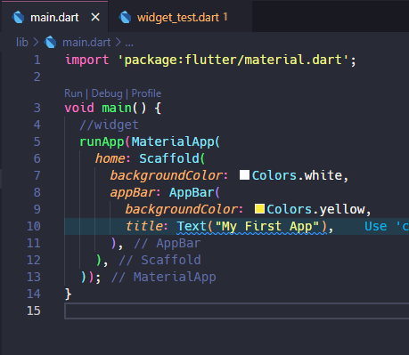
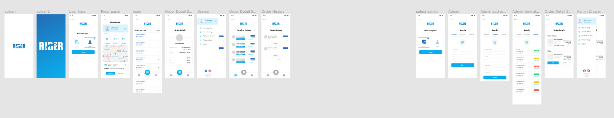

# Project Name

[Project Description]

## Demo

[Add a brief description of your project and insert screenshots or GIFs to showcase its functionality.]




## Features

- [Feature 1]
- [Feature 2]
- [Feature 3]

## Technologies Used

- [Technology 1]
- [Technology 2]
- [Technology 3]

## Installation

[Provide steps to install and run the project locally.]

1. Clone the repository:

```bash
git clone https://github.com/your-username/project-name.git
